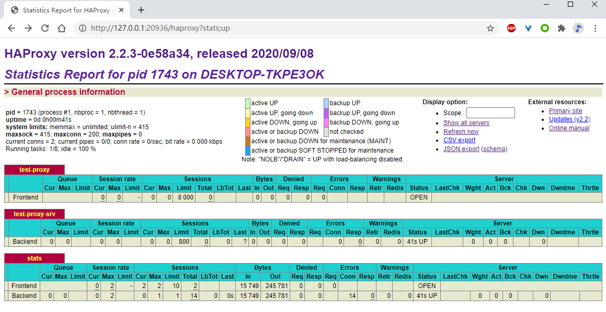
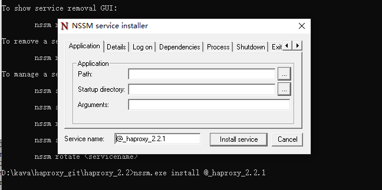
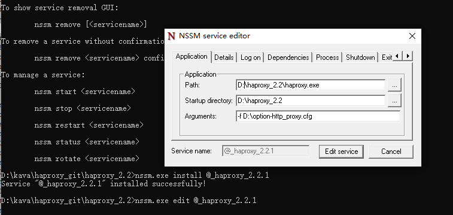
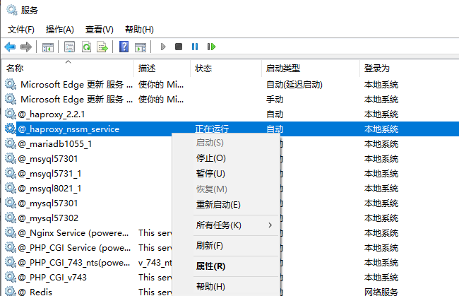

# Blog

- Personal Blog  [https://xinzhiba.top/kb/](https://xinzhiba.top/kb/docs/git/c1_git_config)  for haproxy usages


# haproxy

I have been using HaProxy frequently recently, but there's no Windows version can be found online , so I Share the compiled results.

windows cygwin compile's version Can't support all Different parameters like version  that compiled at  linux platform.

`` JUST For testing purposes only ``




## Intro

> haproxy for windows build.
>
> Just compile by step:
> make TARGET=cygwin
>
> or
>
> make TARGET=cygwin TRACE=1

`` haproxy.exe `` only  depend on ``  cygwin1.dll``


## USAGE

### check configure file & console daemon running


```
D:\haproxy_2.2>.\haproxy.exe -c -f option-http_proxy.cfg
Configuration file is valid

D:\haproxy_2.2>.\haproxy.exe -f option-http_proxy.cfg -D
[WARNING] 261/154118 (1099) : Failed to get the default value of TCP_MAXSEG
[WARNING] 261/154118 (1099) : Failed ot get the default value of TCP_MAXSEG for IPv6
[NOTICE] 261/154118 (1099) : haproxy version is 2.2.3-0e58a34
[ALERT] 261/154118 (1099) : Starting frontend test-proxy: cannot bind socket [0.0.0.0:38080]
[ALERT] 261/154118 (1099) : Starting proxy stats: cannot bind socket [0.0.0.0:20936]

D:\haproxy_2.2>tasklist | findstr haproxy
haproxy.exe                  17772 Services                   0      7,692 K

D:\haproxy_2.2>
```

### version & help

```

D:\haproxy_2.2>.\haproxy.exe -v
HA-Proxy version 2.2.3-0e58a34 2020/09/08 - https://haproxy.org/
Status: long-term supported branch - will stop receiving fixes around Q2 2025.
Known bugs: http://www.haproxy.org/bugs/bugs-2.2.3.html
Running on: CYGWIN_NT-10.0-19041 3.1.7-340.x86_64 2020-08-22 17:48 UTC x86_64

D:\haproxy_2.2>.\haproxy.exe -h
HA-Proxy version 2.2.3-0e58a34 2020/09/08 - https://haproxy.org/
Status: long-term supported branch - will stop receiving fixes around Q2 2025.
Known bugs: http://www.haproxy.org/bugs/bugs-2.2.3.html
Running on: CYGWIN_NT-10.0-19041 3.1.7-340.x86_64 2020-08-22 17:48 UTC x86_64
Usage : haproxy [-f <cfgfile|cfgdir>]* [ -vdVD ] [ -n <maxconn> ] [ -N <maxpconn> ]
        [ -p <pidfile> ] [ -m <max megs> ] [ -C <dir> ] [-- <cfgfile>*]
        -v displays version ; -vv shows known build options.
        -d enters debug mode ; -db only disables background mode.
        -dM[<byte>] poisons memory with <byte> (defaults to 0x50)
        -V enters verbose mode (disables quiet mode)
        -D goes daemon ; -C changes to <dir> before loading files.
        -W master-worker mode.
        -q quiet mode : don't display messages
        -c check mode : only check config files and exit
        -n sets the maximum total # of connections (uses ulimit -n)
        -m limits the usable amount of memory (in MB)
        -N sets the default, per-proxy maximum # of connections (0)
        -L set local peer name (default to hostname)
        -p writes pids of all children to this file
        -dp disables poll() usage even when available
        -dr ignores server address resolution failures
        -dV disables SSL verify on servers side
        -dW fails if any warning is emitted
        -sf/-st [pid ]* finishes/terminates old pids.
        -x <unix_socket> get listening sockets from a unix socket
        -S <bind>[,<bind options>...] new master CLI


```

## Service Install 

 nssm service managerment tools  [https://nssm.cc/](https://nssm.cc/) 

### nssm gui 



```
D:\haproxy_2.2>nssm.exe install @_haproxy_2.2.1
Service "@_haproxy_2.2.1" installed successfully!

```





### nssm manual

```
D:\kava\haproxy_git\haproxy_2.2>nssm.exe -h
NSSM: The non-sucking service manager
Version 2.24 64-bit, 2014-08-31
Usage: nssm <option> [<args> ...]

To show service installation GUI:

        nssm install [<servicename>]

To install a service without confirmation:

        nssm install <servicename> <app> [<args> ...]

To show service editing GUI:

        nssm edit <servicename>

To retrieve or edit service parameters directly:

        nssm get <servicename> <parameter> [<subparameter>]

        nssm set <servicename> <parameter> [<subparameter>] <value>

        nssm reset <servicename> <parameter> [<subparameter>]

To show service removal GUI:

        nssm remove [<servicename>]

To remove a service without confirmation:

        nssm remove <servicename> confirm

To manage a service:

        nssm start <servicename>

        nssm stop <servicename>

        nssm restart <servicename>

        nssm status <servicename>

        nssm rotate <servicename>

D:\kava\haproxy_git\haproxy_2.2>

```


### port monitor

```
D:\haproxy_2.2>netstat -na | findstr 20936
  TCP    0.0.0.0:20936          0.0.0.0:0              LISTENING


```


